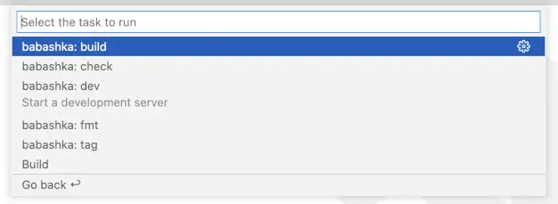

# Babashka Tasks

Run your Babashka tasks from VS-Code!

[![VS-Code Marketplace][vscode-badge]][vscode]
[![GitHub Build][build-badge]][github]

This extension registers a [task provider][vscode-tasks] that finds
Babashka tasks in `bb.edn` files in your workspace.

Requires Babashka (`bb` executable) to be installed on your system
to run the tasks.

## Usage

See the [Official VS-Code Tasks Guide][vscode-tasks] for a complete
description.

### Auto-detect tasks

`babashka-tasks` automatically scans your project for `bb.edn` files and
provides configured tasks to VS-Code.  Use the **Run Task** command to see
all available tasks:



### Configure tasks

You can configure Babashka tasks in `.vscode/tasks.json`, using the `babashka`
type and the name of the task as the `task` property.

Here we configure `bb build` as the default build task that can be executed
using a keyboard shortcut (`Cmd+Shift+B` on Mac):

```json
{
  "version": "2.0.0",
  "tasks": [
    {
      "label": "Build",
      "type": "babashka",
      "task": "build",
      "problemMatcher": [],
      "group": {
        "kind": "build",
        "isDefault": true
      }
    }
  ]
}
```

## License

Copyright 2022 Ferdinand Beyer.  
Distributed under the [MIT License](LICENSE).

[build-badge]: https://img.shields.io/github/workflow/status/ferdinand-beyer/vscode-babashka-tasks/CI?style=flat-square
[vscode-badge]: https://img.shields.io/visual-studio-marketplace/v/fbeyer.babashka-tasks?label=vs-code&style=flat-square

[github]: https://github.com/ferdinand-beyer/vscode-babashka-tasks
[vscode]: https://marketplace.visualstudio.com/items?itemName=fbeyer.babashka-tasks

[vscode-tasks]: https://code.visualstudio.com/docs/editor/tasks
